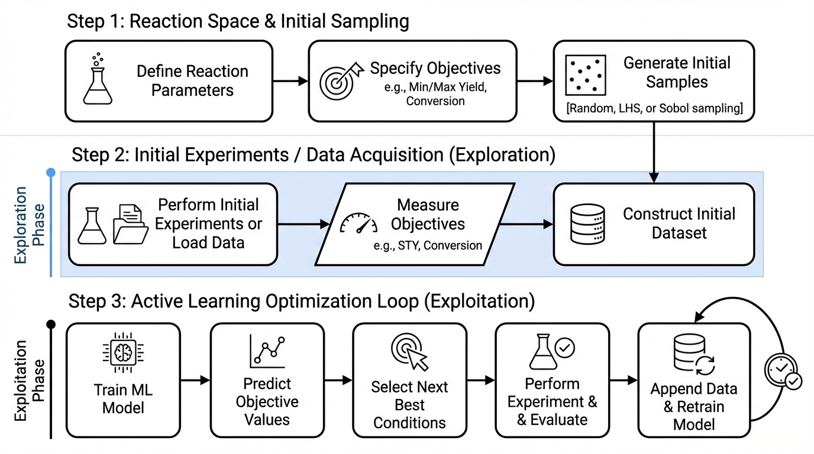

.. _user_guide:

User Guide
==========

AMLRO provides a Python framework for iterative optimization of reaction
conditions. The framework is organized into **three main steps**, each exposed
as a dedicated function that can be called by the user:

1. Reaction Space Generation → ``get_reaction_scope()``
2. Training Set Generation → ``generate_training_data()``
3. Active Learning Prediction → ``get_optimized_parameters()``

    Overview of the AMLRO workflow.

The user guide explains these steps, configuration options, and file formats.
Users do **not** need to modify internal ML models, Pareto front calculations,
or optimization algorithms. AMLRO handles these internally based on the
configuration provided.

.. toctree::
    :maxdepth: 1

    Configurations <configurations>
    Reaction Space Generation <reaction_space>
    Generate Training Data <training_data>
    Active Learning Prediction <active_learning>
